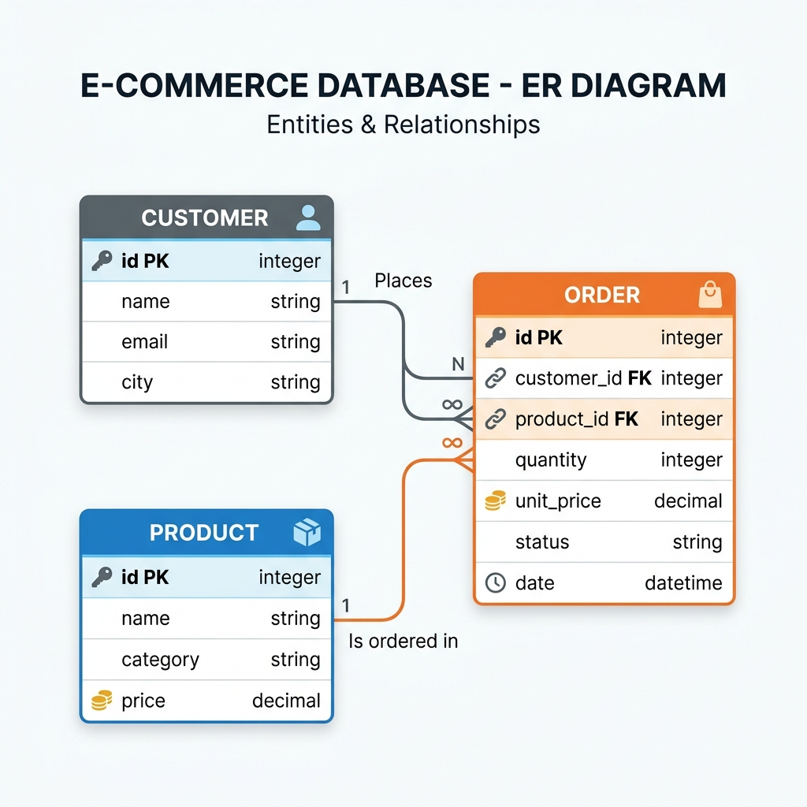

# Spark Delta & Iceberg

## Sobre o Projeto

Este projeto foi desenvolvido como trabalho universitário da disciplina de **Arquitetura de Dados**.  
O objetivo é demonstrar, de forma prática, o uso de formatos de tabela transacionais — **Delta Lake** e **Apache Iceberg** — sobre o motor de processamento **Apache Spark (PySpark)**.

**Participantes:** Gabriel Minatto · Anderson dos Santos · Lorenzo  
**Repositório:** [github.com/Lorenbou/spark-delta-apache](https://github.com/Lorenbou/spark-delta-apache)

---

## Cenário de Negócio

Modelamos uma **plataforma de e-commerce** simplificada com três entidades principais:

| Entidade | Descrição |
|---|---|
| **Cliente** | Dados cadastrais do comprador (nome, e-mail, cidade) |
| **Produto** | Catálogo com categoria e preço |
| **Pedido** | Relaciona cliente e produto com status, quantidade e data |

Este cenário permite demonstrar operações DML de forma realista:

- **INSERT** — registrar novos clientes, produtos e pedidos
- **UPDATE** — atualizar status de pedidos e preços de produtos
- **DELETE** — cancelar (remover) pedidos

---

## Modelo Entidade-Relacionamento



```
┌──────────────┐         ┌──────────────┐
│   CUSTOMER   │         │   PRODUCT    │
├──────────────┤         ├──────────────┤
│ customer_id  │PK       │ product_id   │PK
│ name         │         │ name         │
│ email        │         │ category     │
│ city         │         │ price        │
└──────┬───────┘         └──────┬───────┘
       │                        │
       │      ┌─────────────────┘
       │      │
       ▼      ▼
┌─────────────────────┐
│        ORDER        │
├─────────────────────┤
│ order_id     (PK)   │
│ customer_id  (FK)   │
│ product_id   (FK)   │
│ quantity            │
│ unit_price          │
│ status              │
│ order_date          │
└─────────────────────┘
```

---

## Tecnologias Utilizadas

| Tecnologia | Versão | Papel |
|---|---|---|
| **Apache Spark** | 3.5.3 | Motor de processamento distribuído |
| **PySpark** | 3.5.3 | API Python do Apache Spark |
| **Delta Lake** | 3.2.0 | Formato de tabela ACID sobre Spark |
| **Apache Iceberg** | 1.6.1 | Formato de tabela aberto para dados analíticos |
| **Poetry** | — | Gerenciamento de dependências Python |
| **JupyterLab** | ≥4.2.5 | Ambiente de execução dos notebooks |

---

## Notebooks

Os notebooks estão na pasta `notebooks/` do repositório:

- **`delta_lake.ipynb`** — Demonstração completa com Delta Lake: DDL, INSERT, UPDATE, DELETE e Time Travel
- **`apache_iceberg.ipynb`** — Demonstração completa com Apache Iceberg: DDL, INSERT, UPDATE, DELETE e Snapshots

---

## Referências

- [Canal DataWay BR (YouTube)](https://www.youtube.com/@DataWayBR)
- [spark-delta — jlsilva01](https://github.com/jlsilva01/spark-delta)
- [spark-iceberg — jlsilva01](https://github.com/jlsilva01/spark-iceberg)
